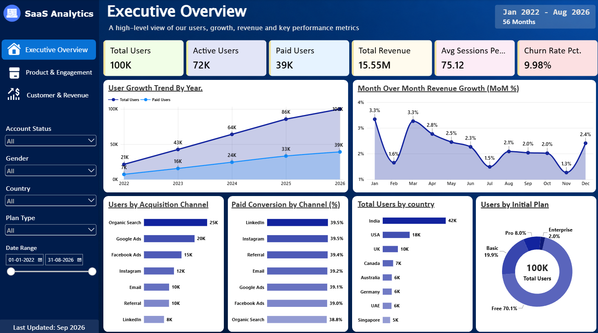
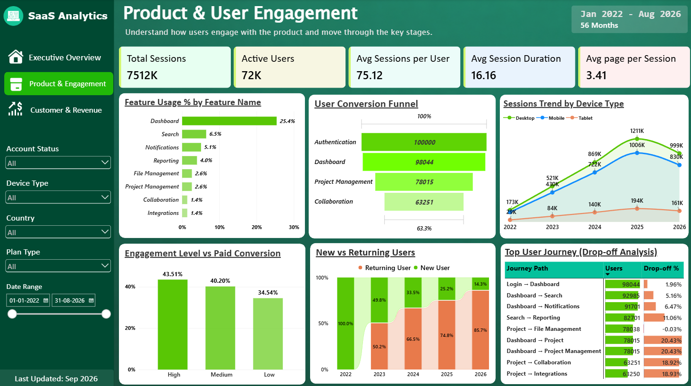
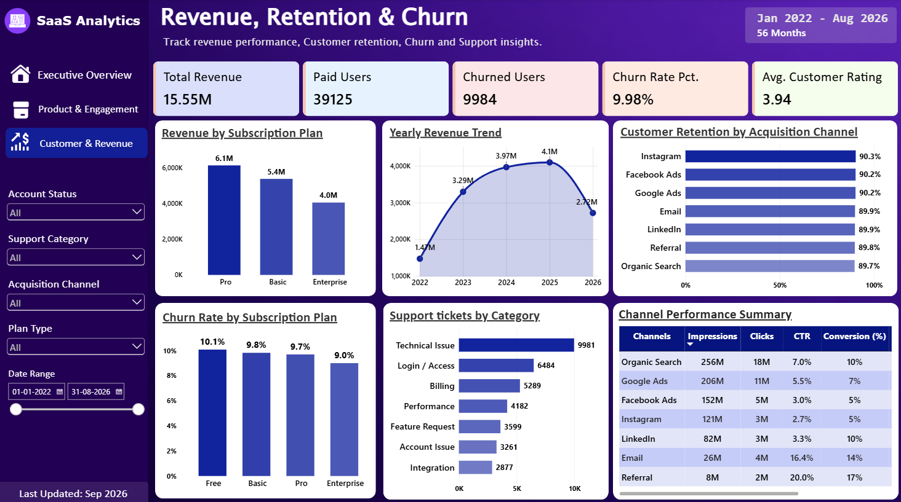

# Product Analytics & User Growth | SaaS Analytics

**End-to-end product and business analytics project using Python, PostgreSQL, and Power BI**

   

> **Portfolio project:** Analysis of a **synthetic** SaaS dataset covering **January 2022–August 2026**, with **100,000 users** and activity across acquisition, engagement, subscriptions, revenue, marketing, and customer support. Figures represent simulated business data, not the performance of a real company.

**[View Live Dashboard](SaaS_Analytics_Dashboards.pbit)** · **[View Portfolio](https://malaybhunia-ds.netlify.app/)** · **[Explore SQL Insights](Business_Insights.md)**

<!-- Replace YOUR_POWER_BI_DEMO_LINK_HERE after publishing your Power BI report. -->

## Project overview

This project examines the SaaS customer lifecycle—from acquisition and product adoption to paid conversion, revenue, retention, and support. It combines Python-based exploratory data analysis, PostgreSQL business queries, and a three-page interactive Power BI report to turn high-volume event and transaction data into actionable business insights.

### Business questions

- Which acquisition channels bring users, and how do their conversion and retention rates compare?
- Which product features are most used, and where do users drop off in the product funnel?
- How do subscription plans contribute to revenue, and how do customers move between plans?
- How do engagement and support-ticket volume relate to paid conversion and churn?
- Which marketing channels generate conversions efficiently relative to spend?

## Dataset

The project uses seven **synthetic** CSV datasets. The reporting period is **2022-01-01 to 2026-08-31**.

| Dataset | Rows | Purpose |
|---|---:|---|
| `users.csv` | 100,000 | User profiles, signup dates, acquisition channels, account status |
| `sessions.csv` | 7,512,229 | Session activity, device types, duration, page views |
| `product_events.csv` | 14,713,576 | Product interactions and feature usage |
| `subscriptions.csv` | 169,981 | Subscription plans and plan changes |
| `transactions.csv` | 445,665 | Transaction-level revenue |
| `marketing_campaigns.csv` | 100,000 | Impressions, clicks, conversions, campaign spend |
| `support_tickets.csv` | 35,673 | Support categories, resolution times, ratings |

> **Data note:** The files are simulated and are intended for analytics practice and portfolio demonstration. Marketing conversions, paid subscribers, and unique transaction users are different metrics and should not be treated as interchangeable.

## Tools & methodology

| Tool | Application |
|---|---|
| **Python** (Pandas, NumPy, Matplotlib, Seaborn) | Data exploration, quality checks, distributions, and initial analysis |
| **PostgreSQL** | Joins, aggregations, cohort-style comparisons, funnels, subscription analysis, and business questions |
| **Power BI** (Power Query, DAX) | Data modeling, KPI measures, interactive visuals, slicers, and executive reporting |
| **Jupyter Notebook** | Reproducible exploratory data analysis |

**Workflow:** Synthetic CSV data → Python EDA → PostgreSQL business analysis → Power BI data model and DAX → dashboard insights.

## Power BI dashboard

The report has three pages designed to answer complementary business questions.

### 1. Executive Overview

High-level KPIs and trends across users, acquisition, paid conversion, revenue, and churn.



### 2. Product & User Engagement

Session activity, feature adoption, conversion funnel, engagement segments, device trends, and user journeys.



### 3. Revenue & Customer Health

Revenue by plan, monthly revenue, churn and retention, marketing efficiency, and support-ticket performance.



**[Open the interactive Power BI dashboard](SaaS_Analytics_Dashboards.pbit)**

## Selected findings

The following findings are from the synthetic dataset and describe **observed associations**, not causal effects.

| Area | Finding |
|---|---|
| **User base** | 100,000 users generated 7.51M sessions (75.12 sessions per user on average). |
| **Acquisition** | Organic Search contributed the most users (25,107), followed by Google Ads (20,114). |
| **Product adoption** | 98,044 users reached the dashboard, 78,015 reached project-related activity, and 63,251 reached collaboration. |
| **Funnel drop-off** | Dashboard → Project had a 20.43% drop-off; Project → Collaboration had an 18.92% drop-off. |
| **Engagement** | Paid conversion was 43.51% among high-engagement users, versus 34.54% among low-engagement users, under the project's engagement definitions. |
| **Revenue** | Total transaction value was **$15.55M**; Pro contributed **$5.62M**, Basic **$4.93M**, and Enterprise **$3.72M**. |
| **Churn** | 9,984 users were marked churned, representing **9.98%** of the user base. This is a snapshot based on current account status, not a historical monthly churn series. |
| **Support & churn** | Users with 3+ support tickets had a 34.64% churn rate, versus 7.65% among users with no tickets. |
| **Marketing efficiency** | Email had a **$0.28** cost per marketing conversion; Referral **$1.05**; LinkedIn **$28.03**. |

### Business implications

- **Product activation:** Investigate friction between dashboard use and project-related activity, the largest drop-off in the tracked core funnel.
- **Engagement:** Examine which behaviors distinguish high-engagement users; the conversion gap is correlational and does not establish causality.
- **Customer health:** Prioritize investigation of recurring support issues and their relationship with churn.
- **Marketing:** Compare channel-level conversion volume and cost per conversion when evaluating spend allocation; campaign conversions are **not** the same as acquired paying customers.

## SQL business analysis

The PostgreSQL analysis covers **24 business questions** organized into six sections:

1. User Growth & Acquisition
2. Product Engagement
3. Funnel & Conversion
4. Subscription & Revenue
5. Retention & Churn
6. Marketing & Support

See **[Business Insights](Business_Insights.md)** for the queries, outputs, and interpretations. Add your SQL scripts under `sql/` if you decide to publish them separately.

## Repository structure

```text
Product_Analytics_SaaS/
├── assets/
│   └── dashboard/
│       ├── executive_overview.png
│       ├── product_user_engagement.png
│       └── revenue_customer_health.png
├── data/
│   └── raw/                  # Synthetic source CSVs (if hosted)
├── notebooks/
│   └── EDA.ipynb
├── src/                      # Data generation / processing scripts
├── sql/                      #  PostgreSQL queries
├── business_insights.md
├── Product_Analytics_SaaS.pbix
└── README.md
```

> **Large-file note:** `sessions.csv`, `transaction.csv` and `product_events.csv` contain millions of rows. Avoid committing files that exceed GitHub's file-size limits. If necessary, publish a reproducible data-generation script, sample files, or an external dataset link instead. The `.pbix` file may also require Git LFS or an external download link depending on its size.

## Reproducing the analysis

1. Obtain or generate the synthetic CSV files and place them in `data/raw/`.
2. Open `notebooks/EDA.ipynb` and run the exploratory analysis in Jupyter.
3. Import the CSVs into PostgreSQL and run the documented business queries.
4. Open `Product_Analytics_SaaS.pbix` in Power BI Desktop, update data-source paths if needed, and refresh the model.
5. Review the three report pages and compare major KPI totals with the SQL results.

*Reproduction depends on the datasets/scripts and Power BI file you choose to publish. Update these instructions to match the final repository contents.*

## Limitations

- The data is **synthetic**; insights are demonstrations of analytical methodology, not claims about a real SaaS business.
- Some measures use current account status, so they should not be interpreted as historical churn or retention trends without dated status-change records.
- Marketing campaign conversions are not equivalent to paid subscribers or revenue-generating customers.
- Observed relationships between engagement, support interactions, and churn do not demonstrate causation.

## Author

**Malay Bhunia**  
Aspiring Data Analyst | Python · PostgreSQL · Power BI · Excel  
[Portfolio](https://malaybhunia-ds.netlify.app/)

---

*Built as an end-to-end analytics portfolio project to demonstrate exploratory analysis, SQL business problem-solving, data modeling, and interactive BI storytelling.*
